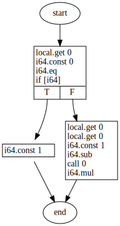

[](https://circleci.com/gh/binji/wasp)

# wasp

Wasp is a C++ library designed to make it easy to work with WebAssembly
modules. Unlike tools like [wabt][], it is designed to be used as a library.

It also includes the `wasp` tool, which has the following commands:

* `wasp dump`: Dump the contents of a WebAssembly module
* `wasp callgraph`: Generate a [dot graph][] of the module's callgraph
* `wasp cfg`: Generate a [dot graph][] of a function's [control-flow graph][]
* `wasp dfg`: Generate a [dot graph][] of a function's [data-flow graph][]
* `wasp validate`: Validate a WebAssembly module
* `wasp pattern`: Find instruction sequence patterns
* `wasp wat2wasm`: Convert a Wasm text file to a Wasm binary file

## wasp dump examples

Disassemble all functions in a module:

```sh
$ wasp dump -d mod.wasm
```

Display all sections in a module:

```sh
$ wasp dump -h mod.wasm
```

Display the contents of the "import" section:

```sh
$ wasp dump -j import -x mod.wasm
```

## wasp callgraph examples

Write the callgraph as a DOT file to stdout.

```sh
$ wasp callgraph mod.wasm
```

Write the callgraph as a DOT file to `file.dot`.

```sh
$ wasp callgraph mod.wasm -o file.dot
```

You can use graphviz to convert the DOT file to an SVG:

```sh
$ dot -Tsvg file.dot -O
```

For example, the following wasm file:

```wasm
(func $a call $b)
(func $b call $c call $d)
(func $c)
(func $d call $a call $b call $d)
```

Becomes this SVG:


## wasp cfg examples

Write the CFG of function 0 as a DOT file to stdout.

```sh
$ wasp cfg -f 0 mod.wasm
```

Write the CFG of function `foo` as a DOT file to `file.dot`.

```sh
$ wasp cfg -f foo mod.wasm -o file.dot
```

For example, the following wasm file:

```wasm
(func $fac (param i64) (result i64)
  (if (result i64) (i64.eq (local.get 0) (i64.const 0))
    (then (i64.const 1))
    (else
      (i64.mul (local.get 0) (call 0 (i64.sub (local.get 0) (i64.const 1)))))))
```

Becomes this SVG:



## wasp dfg examples

Write the DFG of function 0 as a DOT file to stdout.

```sh
$ wasp dfg -f 0 mod.wasm
```

Write the DFG of function `foo` as a DOT file to `file.dot`.

```sh
$ wasp dfg -f foo mod.wasm -o file.dot
```

For example, the following wasm file:

```wasm
(func $fac (param i64) (result i64)
  (if (result i64) (i64.eq (local.get 0) (i64.const 0))
    (then (i64.const 1))
    (else
      (i64.mul (local.get 0) (call 0 (i64.sub (local.get 0) (i64.const 1)))))))
```

Becomes this SVG:


## wasp validate examples

Validate a module.

```sh
$ wasp validate mod.wasm
```

Validate multiple modules.

```sh
$ wasp validate mod1.wasm mod2.wasm mod3.wasm
```

## wasp pattern examples

Print the 10 most common instruction sequences.

```sh
$ wasp pattern mod.wasm -d 10
```

This produces results similar to those shown below. The columns are as follows:

1. How often the instruction sequence occurred
2. The instruction sequence length
3. The instruction sequence
4. A percentage, calculated as `100 * count * sequence length / total instructions`.

```
71333: [2] [i32.const 0 global.set 10] 4.17%
37382: [2] [end end] 2.19%
34937: [2] [i32.const 1 i32.and] 2.04%
25099: [2] [block [] block []] 1.47%
21440: [2] [i32.and if []] 1.25%
20154: [2] [i32.eqz if []] 1.18%
19883: [3] [i32.const 1 i32.and if []] 1.75%
18643: [2] [return end] 1.09%
15857: [3] [block [] block [] block []] 1.39%
15314: [2] [end local.get 0] 0.90%
total instructions: 3417737
```

## wasp wat2wasm examples

Convert `test.wat` to `test.wasm`.

```sh
$ wasp wat2wasm test.wat
```

Convert `test.wat` to `something.wasm`.

```sh
$ wasp wat2wasm test.wat -o something.wasm
```

Convert `test.wat` to `test.wasm`, but skip validation.

```sh
$ wasp wat2wasm test.wat --no-validate
```

Convert `test.wat` to `test.wasm`, and enable the SIMD feature.

```sh
$ wasp wat2wasm test.wat --enable-simd
```

[wabt]: https://github.com/WebAssembly/wabt
[dot graph]: http://graphviz.gitlab.io/documentation/
[control-flow graph]: https://en.wikipedia.org/wiki/Control-flow_graph
[data-flow graph]: https://en.wikipedia.org/wiki/Data-flow_analysis
